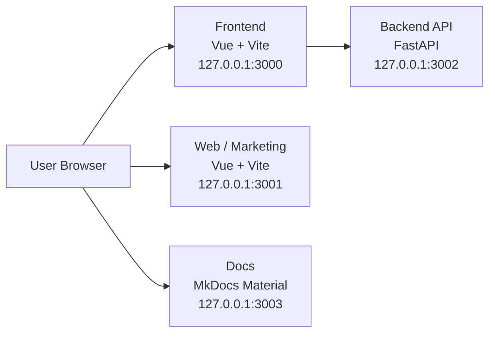

# ITSoR

IT System of Record

## Architecture

## Quickstart

Canonical onboarding and setup instructions live in:

- [Getting Started](../developer/getting-started.md)

Use that page for prerequisites, Windows no-`make` fallback commands, environment setup, and local service startup.

This root README intentionally keeps setup guidance minimal to avoid conflicting quickstart instructions.

## Testing Layout

This repository uses a hybrid testing structure:

- `backend/tests/` for backend unit/API tests
- `tests/integration/` for cross-project integration tests
- `tests/e2e/` for full end-to-end user-flow tests

`pytest` discovery is configured via `pytest.ini` for backend and integration test paths.

## Feature Roadmap Snapshot

### In place

- ✅ Pydantic-based data validation and settings patterns through FastAPI schemas/config.
- ✅ Secure password hashing by default.
- ✅ JWT-based authentication.
- ✅ Backend testing with Pytest.
- ✅ GitHub Actions CI foundation.

### Planned / expanding

- 🛠 PostgreSQL as the production SQL database.
- 🛠 Modern frontend stack expansion: TypeScript + Vite conventions and shared app patterns.
- 🛠 Tailwind CSS + shadcn/ui component system.
- 🛠 Playwright end-to-end tests.
- 🛠 Application-level dark mode support.
- 🛠 Docker Compose for development and production workflows.
- 🛠 Email-based password recovery.
- 🛠 Mailcatcher for local email testing.
- 🛠 Traefik reverse proxy/load balancer.
- 🛠 Docker Compose deployment instructions, including Traefik-managed HTTPS certificates.
- 🛠 CI/CD expansion on GitHub Actions (deployment automation).
- 🛠 Automatically generated frontend API client from backend contract.

## Backend Configuration

Backend runtime configuration currently uses root `.env` values provided through `make` targets.

Active backend env vars:

- `HOST`
- `FRONTEND_PORT`
- `WEB_PORT`

These values are used for backend CORS origin handling in local development.

See docs for details:

- `docs/local-config.md`
- `docs/backend-env.md`

## Contributing Standards

### Branch naming

Use lowercase, hyphen-separated branch names:

- `feature/<short-description>`
- `fix/<short-description>`
- `docs/<short-description>`
- `chore/<short-description>`

Examples:

- `feature/user-profile-api`
- `fix/login-timeout`
- `docs/quickstart-update`

### Pull request checklist

- Scope is focused and tied to one objective.
- Branch is up to date with `main`.
- Local checks run successfully (`make docs-dev`, `make backend-dev`, `make frontend-dev` as applicable).
- README/docs are updated for behavior or command changes.
- PR description includes summary, testing notes, and follow-up tasks.

### Release notes

For each merge intended for release, include a short release-note entry in the PR description:

- **Type**: `feature`, `fix`, `docs`, or `chore`
- **Summary**: one sentence describing user/developer impact
- **Migration/Breaking Change**: `none` or concise required action

