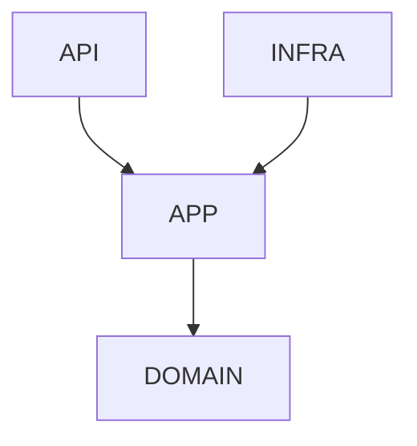
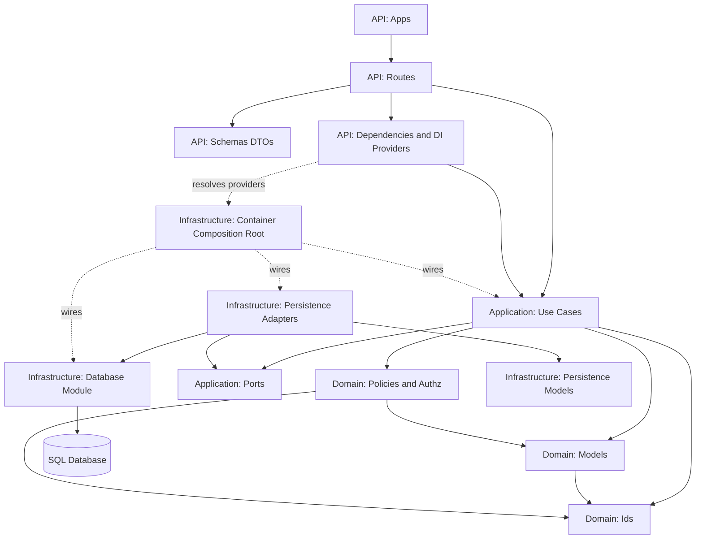

# Architecture

## Repository layout

- `Apple/` platform-specific components
- `backend/` service and API implementation
- `frontend/` UI and client application code
- `docs/` this documentation site

## Layers (Strict Hexagonal)

- Backend
    - Inbound Adapters (`API`)
        - Apps
        - Routes
        - Schemas (request/response DTOs)
        - Dependencies (DI entry points)
    - Inbound Adapters (`Non-HTTP`)
        - Background jobs / workers (scheduled or queue-driven)
        - CLI/admin commands
        - Inbound webhooks / event consumers
    - Application Core (`Domain Use Cases`)
        - Use Cases
        - Input/Output Ports
        - Application Services (orchestration only)
    - Domain Core (`Pure Domain`)
        - Domain Models (entities/value objects)
        - Domain Policies / Authz Rules
        - Shared Kernel: `domain.ids` (cross-slice identity value objects)
    - Outbound Adapters (`Infrastructure`)
        - Persistence Adapters (repository implementations)
        - File Adapters (import/export, object storage)
        - Messaging Adapters (email, notifications, event bus/queue)
        - Integration Adapters (3rd-party APIs, outbound webhooks)
        - Observability Adapters (audit trail, telemetry sinks)
        - Database Module (engine/session lifecycle and DB bootstrap)
        - Persistence Models (ORM/API payload models)
        - Container/Composition Root (`infrastructure/container.py` wiring)
    - Supporting
        - Migrations
        - Tests
        - Requirements

### Strict Call Rules (Allowed vs Not Allowed)

| From Layer | Allowed to Call | Not Allowed to Call |
| --- | --- | --- |
| API Routes | API Schemas, API Dependencies, Application Use Cases (or Input Ports) | Domain Models directly, `domain.ids` directly, Outbound Adapters/ORM directly |
| API Dependencies | Container wiring, Application Use Cases (factory/provider role) | Business logic, direct endpoint behavior |
| Inbound Non-HTTP Adapters (workers/CLI/webhooks) | Application Use Cases (or Input Ports), API-agnostic DTO mapping | Domain Models directly, ORM/DB clients directly, API route/schemas imports |
| Application Use Cases | Domain Models/Policies, `domain.ids`, Application Ports | API layer, ORM/DB/framework clients |
| Domain Models / Policies | Other Domain constructs only | API/Application/Infrastructure/framework imports |
| Domain Shared Kernel (`domain.ids`) | Domain Models, Domain Policies, Application Use Cases, Outbound Adapters | API layer imports |
| Outbound Adapters | Application/Domain Ports (implements), DB/ORM/external clients | API layer, endpoint schemas |
| Database Module (`infrastructure.database.sqlalchemy`) | Engine/session lifecycle, DB bootstrap helpers, SQLAlchemy configuration | Use case logic, endpoint behavior, domain rules |
| Persistence Models (ORM/API payload models) | ORM field mapping/serialization concerns, Outbound Adapters | DB/external clients directly, API Routes/Schemas, Application Use Cases, Domain Models/Policies |
| Container (Composition Root) | Instantiate and wire adapters/use cases | Request handling or business rules |

Preferred dependency direction inside Domain Core:

- Domain Policies/Authz may depend on Domain Models and `domain.ids`.
- Domain Models should not depend on Domain Policies/Authz modules.

Runtime flows:

- HTTP: `API Route -> Use Case -> Port -> Adapter -> DB/External`, then mapped back to API schema responses.
- Background/Webhook/CLI: `Inbound Adapter -> Use Case -> Port -> Adapter -> DB/External`.
- Outbound communications (email/notifications/file export) still originate from Use Cases through outbound ports.

### Adapter expansion points (recommended)

When adding new integrations, keep the same contract-first pattern:

1. Define outbound port in Application layer.
2. Implement adapter in Infrastructure.
3. Keep provider wiring in `infrastructure/container.py`.
4. Keep transport/framework mapping in inbound adapters only.

Typical additions that fit this model:

- File import/export pipelines (CSV/JSON/Parquet, object storage)
- Email delivery and template rendering
- User/system notifications (in-app, push, queue-based)
- Outbound webhook publisher / event bus producer-consumer
- Search indexing adapters
- Caching adapters
- Audit/event journal adapters

## Documentation map

Use this section to keep architecture decisions discoverable:

1. System context
2. Service boundaries
3. Data flows
4. Deployment topology

Core architecture framing:

- [System Definition](system-definition.md)

## Decision records

Add Architecture Decision Records (ADRs) in a dedicated section when introducing major technical changes.

- ADR index: [Architecture Decision Records (ADRs)](adr/README.md)
- Latest: [ADR-0003: Domain Authorization Resolution Precedence and Tie-Break Rules](adr/0003-domain-authorization-resolution-precedence.md)

## Backend subapp route map

The backend FastAPI app exposes a mixed root + mounted-subapp topology:

- Root routers include auth and core resource routes (for example `/health`, `/workspaces`, `/namespaces`, `/entity-types`, `/entity-records`).
- Mounted subapps:
    - `/platform` (platform admin/user/tenant/group and RBAC endpoints)
    - `/idm` (identity and access management app surface)

All route composition is centralized in backend startup wiring and remains independent from infrastructure adapter implementations.

## Next steps

- Review canonical domain entities and temporal model rules: [Domain Model Reference](domain-model-reference.md)
- Align architecture decisions to controls and governance constraints: [Standards Baseline](standards-baseline.md)
- Review external standards and tooling context: [References](references.md)
- Continue to implementation-oriented docs: [Backend Auth Setup](backend-auth-setup.md)
