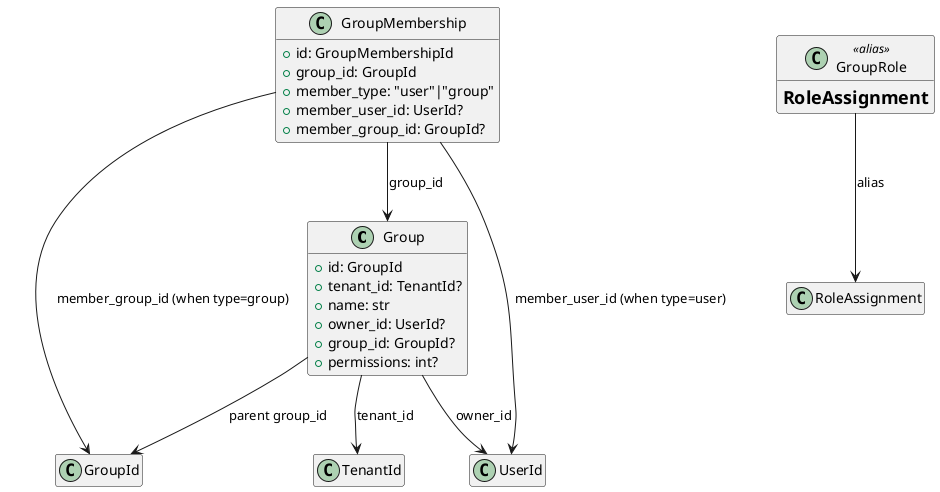

# Group Models

Source: `backend/itsor/domain/models/group_models.py`

---

## Purpose

Defines security or organizational groups and how users/groups become members.

## Models

- **Group**
  - May be tenant-scoped (`tenant_id`) or broader depending on use case
  - Optional owner (`owner_id`) and parent group (`group_id`) references
  - Optional legacy/integer permissions value (`permissions`)
- **GroupMembership**
  - Membership edge with polymorphic member target
  - `member_type` determines whether membership is by user or nested group
- **GroupRole**
  - Alias of `RoleAssignment` from `role_models.py`

## Invariants

- For `member_type = "user"`: `member_user_id` must be set and `member_group_id` must be `None`.
- For `member_type = "group"`: `member_group_id` must be set and `member_user_id` must be `None`.

## PlantUML

