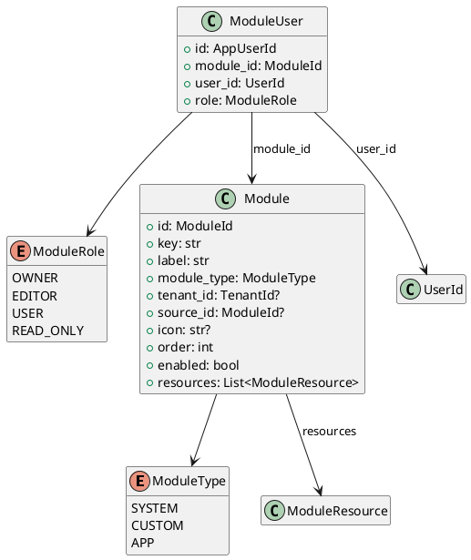

# Module Models

Source: `backend/itsor/domain/models/module_models.py`

---

## Purpose

Defines top-level modules used to organize resources/navigation and the module-scoped user-role binding model.

## Enums

- **ModuleType**: `SYSTEM`, `CUSTOM`, `APP`
- **ModuleRole**: `OWNER`, `EDITOR`, `USER`, `READ_ONLY`

## Models

- **Module**
  - `id`: `ModuleId`
  - `key`, `label`: required normalized identifiers
  - `module_type`: module classification
  - `tenant_id`: optional tenant scope
  - `source_id`: optional lineage to a base module
  - `icon`, `order`, `enabled`
  - `resources`: collection of `ModuleResource`
- **ModuleUser**
  - `id`: `AppUserId`
  - `module_id`, `user_id`
  - `role`: `ModuleRole`

## Invariants

- `Module.key` and `Module.label` are trimmed and required.
- `Module.order` must be greater than or equal to `0`.

## Alias Notes

- Deprecated compatibility aliases remain available through module-level `__getattr__`:
  - `App` -> `Module`
  - `AppRole` -> `ModuleRole`
  - `AppUser` -> `ModuleUser`

## PlantUML

