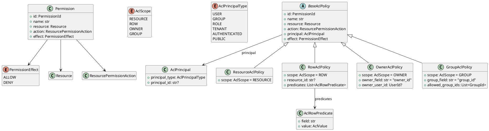

# Permission Models

Source: `backend/itsor/domain/models/permission_models.py`

---

## Purpose

Defines fine-grained permission entries and ACL policies for resource, row, owner, and group scopes.

## Core Enums / Types

- **PermissionEffect**: `ALLOW`, `DENY`
- **AclScope**: `RESOURCE`, `ROW`, `OWNER`, `GROUP`
- **AclPrincipalType**: `USER`, `GROUP`, `ROLE`, `TENANT`, `AUTHENTICATED`, `PUBLIC`
- **ResourcePermissionAction** (from resource models): `CREATE`, `READ`, `UPDATE`, `DELETE`, `EXECUTE`
- **Resource** (from resource models): domain resource identifiers such as `platform.user`, `platform.role`, etc.

## Models

- **Permission**
  - Basic permission tuple: `resource + action + effect`
- **AclPrincipal**
  - Identifies who the policy targets
  - Implicit principals (`AUTHENTICATED`, `PUBLIC`) cannot carry IDs
  - Explicit principals require `principal_id`
- **AclRowPredicate**
  - Field/value predicate for row-level filters
- **BaseAclPolicy**
  - Shared policy fields: `name`, `resource`, `action`, `principal`, `effect`
- **ResourceAclPolicy**
  - Resource-level policy scope
- **RowAclPolicy**
  - Row-level scope with `resource_id` and/or `predicates`
- **OwnerAclPolicy**
  - Owner-based scope using `owner_field` and optional `owner_user_id`
- **GroupAclPolicy**
  - Group-based scope using `group_field` and optional `allowed_group_ids`

## Invariants

- ACL policy names must be non-empty.
- Row ACL must provide either `resource_id` or at least one predicate.
- Owner ACL requires non-empty `owner_field`.
- Group ACL requires non-empty `group_field` and either:
  - a group principal, or
  - non-empty `allowed_group_ids`.

## PlantUML

