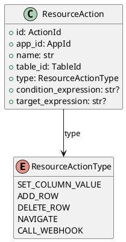

# Resource Action Models

Source: `backend/itsor/domain/models/resource_models/action_models.py`

---

## Purpose

Defines resource-level actions that can be attached to module tables and executed by runtime workflows.

## Models

- **ResourceAction**
  - `id`: `ActionId`
  - `app_id`: owning app/module scope
  - `name`: action display/identity name
  - `table_id`: target table
  - `type`: action kind (`ResourceActionType`)
  - `condition_expression`: optional execution condition
  - `target_expression`: optional target binding

## Enums

- **ResourceActionType**
  - `SET_COLUMN_VALUE`
  - `ADD_ROW`
  - `DELETE_ROW`
  - `NAVIGATE`
  - `CALL_WEBHOOK`

## Aliases

- `Action = ResourceAction`
- `ActionType = ResourceActionType`

## Invariants

- `name` is trimmed and must be non-empty.

## PlantUML

