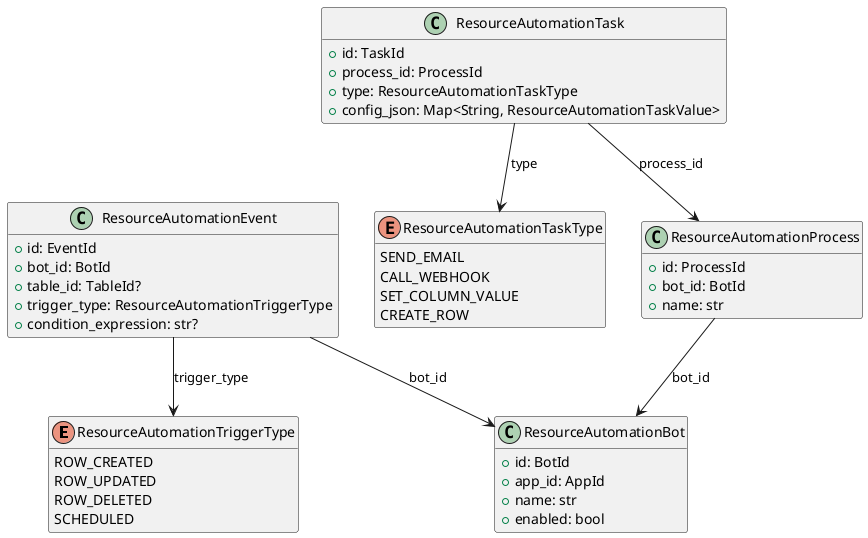

# Resource Automation Models

Source: `backend/itsor/domain/models/resource_models/automation_models.py`

---

## Purpose

Defines automation entities (bot, event, process, task) used to execute rule-driven operations over resource data.

## Models

- **ResourceAutomationBot**
  - Automation container per app with enablement flag.
- **ResourceAutomationEvent**
  - Trigger configuration for row changes or scheduled execution.
- **ResourceAutomationProcess**
  - Named process graph/unit scoped to a bot.
- **ResourceAutomationTask**
  - Executable task with typed task kind and config payload.

## Enums and Type Aliases

- **ResourceAutomationTriggerType**: `ROW_CREATED`, `ROW_UPDATED`, `ROW_DELETED`, `SCHEDULED`
- **ResourceAutomationTaskType**: `SEND_EMAIL`, `CALL_WEBHOOK`, `SET_COLUMN_VALUE`, `CREATE_ROW`
- **ResourceAutomationTaskScalar**: `str | int | float | bool | None`
- **ResourceAutomationTaskValue**: scalar, scalar-list, or scalar dictionary

## Aliases

- `Bot`, `Event`, `Process`, `Task`
- `TriggerType`, `TaskType`, `TaskScalar`, `TaskValue`

## Invariants

- Bot and process names must be non-empty after trimming.
- Scheduled events must not reference `table_id`.
- Row events (`ROW_CREATED/UPDATED/DELETED`) must include `table_id`.

## PlantUML

