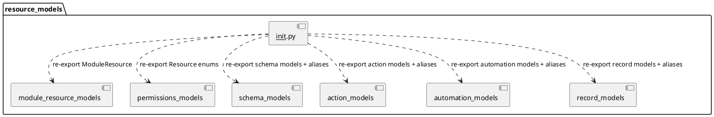

# Resource Models Package Init

Source: `backend/itsor/domain/models/resource_models/__init__.py`

---

## Purpose

Defines the public export surface for resource model types, aliases, and enums.

## Re-exports by Submodule

- **module_resource_models**
  - `ModuleResource`
- **permissions_models**
  - `Resource`
  - `ResourcePermissionAction`
- **schema_models**
  - `Table`, `ResourceAttribute`, `ResourceAttributeType`
  - `ResourceSlice`, `ResourceSecurityRule`
  - `Column`, `ColumnType`, `Slice`, `SecurityRule`
- **action_models**
  - `ResourceAction`, `ResourceActionType`
  - `Action`, `ActionType`
- **automation_models**
  - `ResourceAutomationBot`, `ResourceAutomationEvent`, `ResourceAutomationProcess`, `ResourceAutomationTask`
  - `ResourceAutomationTriggerType`, `ResourceAutomationTaskType`, `ResourceAutomationTaskScalar`, `ResourceAutomationTaskValue`
  - `Bot`, `Event`, `Process`, `Task`, `TriggerType`, `TaskType`, `TaskScalar`, `TaskValue`
- **record_models**
  - `ResourceRecord`, `ResourceRecordScalar`, `ResourceRecordValue`
  - `Row`, `RowScalar`, `RowValue`

## Import Boundary Guidance

- Prefer importing from package root (`itsor.domain.models.resource_models`) in consuming layers.
- Keep submodule imports internal unless you need implementation-specific behavior.
- Treat this package init as the stable contract for resource-model consumers.

## PlantUML

