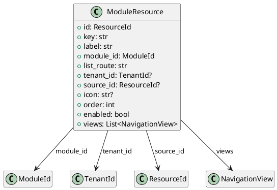

# Module Resource Models

Source: `backend/itsor/domain/models/resource_models/module_resource_models.py`

---

## Purpose

Represents a navigable resource registered under a module/app, including list route, display metadata, and optional source lineage.

## Models

- **ModuleResource**
  - `id`: `ResourceId`
  - `key`: stable resource key
  - `label`: display label
  - `module_id`: owning module
  - `list_route`: route for list blade/page
  - `tenant_id`: optional tenant scoping
  - `source_id`: optional source resource lineage
  - `icon`, `order`, `enabled`
  - `views`: list of `NavigationView`

## Invariants

- `key`, `label`, and `list_route` are trimmed and required.
- `order` must be greater than or equal to `0`.

## PlantUML

