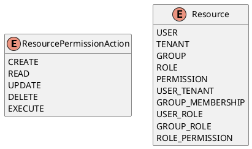

# Resource Permission Enums

Source: `backend/itsor/domain/models/resource_models/permissions_models.py`

---

## Purpose

Defines canonical resource names and permission actions used by authorization and ACL policy models.

## Enums

- **ResourcePermissionAction**
  - `CREATE`, `READ`, `UPDATE`, `DELETE`, `EXECUTE`
  - Includes conversion helpers:
    - `from_verb(verb)`
    - `from_nibble(value)`
    - `to_nibble()`
- **Resource**
  - Platform resources:
    - `USER`, `TENANT`, `GROUP`, `ROLE`, `PERMISSION`
    - `USER_TENANT`, `GROUP_MEMBERSHIP`, `USER_ROLE`, `GROUP_ROLE`, `ROLE_PERMISSION`

## Behavioral Notes

- Verb aliases `write` and `modify` normalize to `UPDATE`.
- Unknown verbs or nibbles raise `ValueError`.
- Nibble mapping is:
  - `CREATE = 0x1`
  - `READ = 0x2`
  - `UPDATE = 0x4`
  - `DELETE = 0x8`
  - `EXECUTE = 0x10`

## PlantUML

