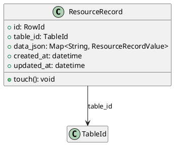

# Resource Record Models

Source: `backend/itsor/domain/models/resource_models/record_models.py`

---

## Purpose

Defines row/record storage model for table data with generic typed JSON payload and lifecycle timestamps.

## Models

- **ResourceRecord**
  - `id`: `RowId`
  - `table_id`: owning table
  - `data_json`: flexible typed row data
  - `created_at`, `updated_at`: UTC timestamps
  - `touch()`: updates `updated_at` to current UTC time

## Type Aliases

- **ResourceRecordScalar**: `str | int | float | bool | None`
- **ResourceRecordValue**: scalar or list of scalars
- Aliases: `Row`, `RowScalar`, `RowValue`

## Behavioral Notes

- `created_at` and `updated_at` are initialized automatically.
- Use `touch()` after mutation workflows to keep update timestamp consistent.

## PlantUML

