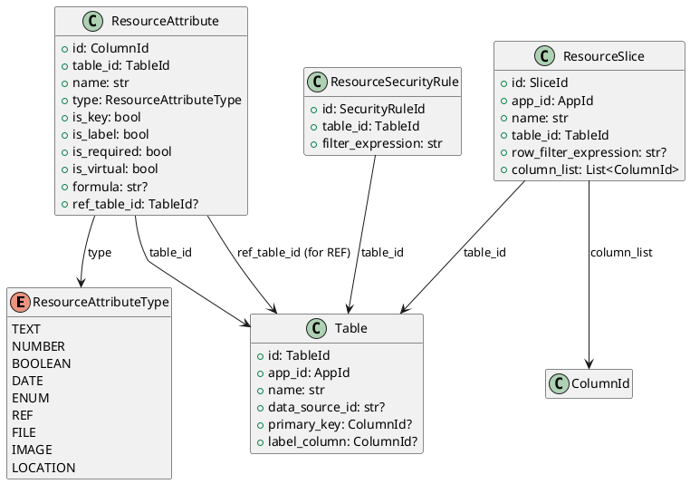

# Resource Schema Models

Source: `backend/itsor/domain/models/resource_models/schema_models.py`

---

## Purpose

Defines schema metadata for table-driven resources: tables, attributes (columns), slices, and security rules.

## Models

- **Table**
  - App-scoped table metadata with optional primary key and label column.
- **ResourceAttribute**
  - Column metadata with type, requirement flags, formulas, and optional table reference.
- **ResourceSlice**
  - Named slice over a table with optional row filter and explicit column list.
- **ResourceSecurityRule**
  - Table-level filter expression for security constraints.

## Enums and Aliases

- **ResourceAttributeType**: `TEXT`, `NUMBER`, `BOOLEAN`, `DATE`, `ENUM`, `REF`, `FILE`, `IMAGE`, `LOCATION`
- Aliases:
  - `Column = ResourceAttribute`
  - `ColumnType = ResourceAttributeType`
  - `Slice = ResourceSlice`
  - `SecurityRule = ResourceSecurityRule`

## Invariants

- `Table.name`, `ResourceAttribute.name`, and `ResourceSlice.name` must be non-empty after trim.
- `ResourceAttribute` rules:
  - `REF` columns require `ref_table_id`.
  - non-`REF` columns must not set `ref_table_id`.
  - virtual columns require a `formula`.
- `ResourceSecurityRule.filter_expression` must be non-empty after trim.

## PlantUML

