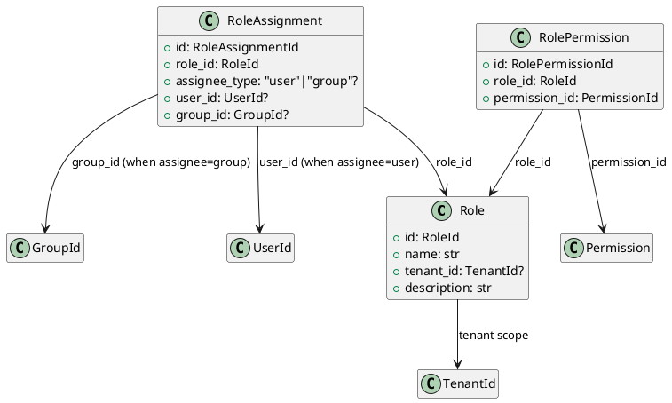

# Role Models

Source: `backend/itsor/domain/models/role_models.py`

---

## Purpose

Provides role definitions, assignee bindings (user/group), and role-to-permission links.

## Models

- **Role**
  - Tenant-scoped role metadata (`name`, `description`, `tenant_id`)
- **RoleAssignment**
  - Assigns one role to exactly one assignee target (user or group)
  - Supports explicit `assignee_type` or inferred type from populated ID
- **RolePermission**
  - Joins a `role_id` with a `permission_id`

## Invariants

- `Role.name` must be non-empty; `description` is normalized/trimmed.
- `RoleAssignment` must include exactly one assignee identifier:
  - `user_id` only, or
  - `group_id` only.
- Invalid `assignee_type` values are rejected.

## PlantUML

