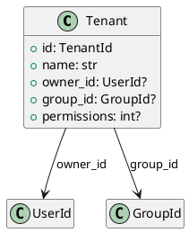

# Tenant Models

Source: `backend/itsor/domain/models/tenant_models.py`

---

## Purpose

Represents a tenant boundary for isolation and ownership.

## Models

- **Tenant**
  - Required `name`
  - Optional owner (`owner_id`) and associated group (`group_id`)
  - Optional integer permissions field

## Invariants

- `Tenant.name` must be a non-empty trimmed string.
- `Tenant.id` is ULID-backed typed identifier.

## PlantUML

