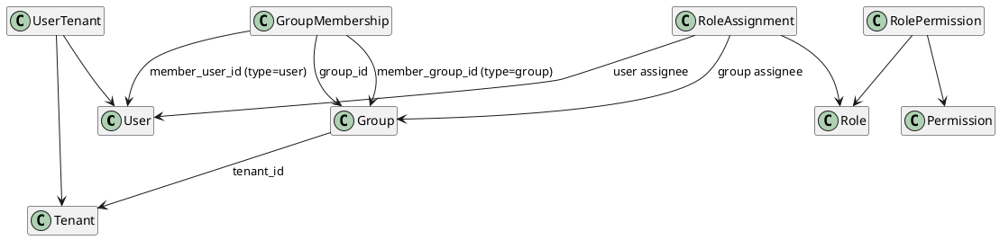

# User Management Models

This page is now an overview hub. Module details are maintained in separate files.

---

## Module Documents

- [User Models](./user_models.md)
- [Group Models](./group_models.md)
- [Tenant Models](./tenant_models.md)
- [Role Models](./role_models.md)
- [Permission Models](./permission_models.md)

---

## Cross-Module Relationship Summary

---

## Notes for Implementers

- Backend model invariants are authoritative; frontend validation should be additive only.
- Keep `RoleAssignment` and `GroupMembership` APIs strict to prevent ambiguous assignees/members.
- Prefer transport DTOs that preserve relationship meaning without leaking internal implementation details.
