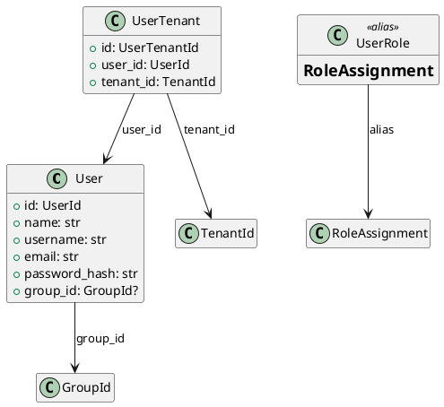

# User Models

Source: `backend/itsor/domain/models/user_models.py`

---

## Purpose

Represents platform users and their tenant membership relationship.

## Models

- **User**
  - Core identity fields: `name`, `username`, `email`, `password_hash`
  - Optional group association: `group_id`
- **UserTenant**
  - Join model linking `user_id` to `tenant_id`
- **UserRole**
  - Alias of `RoleAssignment` from `role_models.py`

## Invariants

- `User.name`, `User.username`, and `User.email` must be non-empty trimmed strings.
- `User.id` and `UserTenant.id` are generated ULID-backed typed identifiers.

## PlantUML

