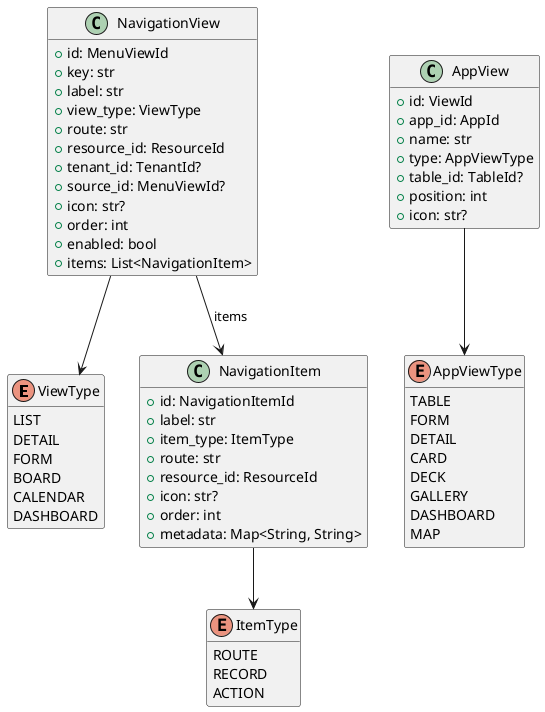

# View Models

Source: `backend/itsor/domain/models/view_models.py`

---

## Purpose

Defines navigation item/view models and app-scoped presentation view models.

## Enums

- **ViewType**: `LIST`, `DETAIL`, `FORM`, `BOARD`, `CALENDAR`, `DASHBOARD`
- **ItemType**: `ROUTE`, `RECORD`, `ACTION`
- **AppViewType**: `TABLE`, `FORM`, `DETAIL`, `CARD`, `DECK`, `GALLERY`, `DASHBOARD`, `MAP`

## Models

- **NavigationItem**
  - `id`: `NavigationItemId`
  - `label`, `item_type`, `route`, `resource_id`
  - `icon`, `order`, `metadata`
- **NavigationView**
  - `id`: `MenuViewId`
  - `key`, `label`, `view_type`, `route`, `resource_id`
  - `tenant_id`, `source_id`, `icon`, `order`, `enabled`
  - `items`: nested `NavigationItem` entries
- **AppView**
  - `id`: `ViewId`
  - `app_id`, `name`, `type`
  - optional `table_id`, `position`, `icon`

## Invariants

- `NavigationItem.label` and `NavigationItem.route` are trimmed and required.
- `NavigationItem.order` must be greater than or equal to `0`.
- `NavigationView.key`, `NavigationView.label`, and `NavigationView.route` are trimmed and required.
- `NavigationView.order` and `AppView.position` must be greater than or equal to `0`.
- `AppView.name` is trimmed and required.

## PlantUML

